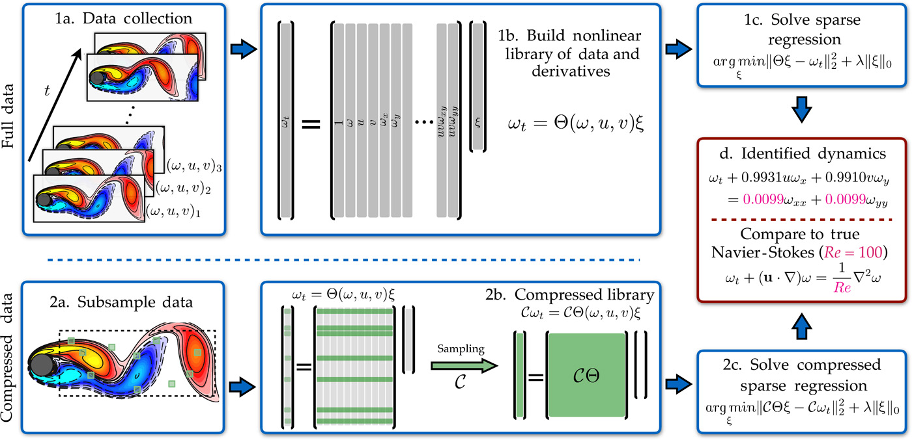

## Interpretability

* **Goal 1**: Better BNS simulations
    - subgrid models
    - turbulence
    - physical observables
* **Goal 2**: Better understanding of meaning
    - simulation systematics
    - do simulation inputs connect to physics?

::: {.notes}
In ML contexts, the word "interpretability" is thrown around a lot. Sometimes it is linked to transparency - a human can understand what the model is doing. Sometimes it is linked to explainability - a human can understand why the model is doing what it is doing. And sometimes it is linked to how the outputs of the model are interpreted - this is often linked to probabilities.

Following on from earlier talks, I am particularly interested in BNS simulations, turbulence, and subgrid models. I am going to look at interpretability by linking it to *effective* models, in the spirit of effective field theory. The idea is that the "best possible" simulation with a particularly discretization scale can be interpreted as the continuum solution of an effective model. By understanding the effective model, we can understand the simulation systematics, and how simulation results may need to be interpreted in order to connect to the "true" physical parameters.

There are some links I want to keep in mind. We know that numerical solutions of fluids contain numerical dissipation. We know that classic LES subgrid models, such as Smagorinsky, are framed in terms of effective viscosity. Finally, we know that key physical features, such as the angular momentum transport in the post-merger remnant, are driven by the effective viscosity of the system. Therefore there is a complex interplay between numerical, subgrid model, and physically observable effects. An understanding of this interplay - formally, the ability to perform uncertainty quantification on the observable - should be *an* aim of our numerical models. The use of an effective model is a way to formalize this understanding.
:::

## LES {footer=false background-image="figures/KH_density_both.svg" background-position="right" background-size="contain"}

::: {.columns}

:::: {.column width="80%"}

* Turbulence gives small scale structure;
* Resolution dependent;
* Subgrid model:
$$
{\small
\partial_t u + \mathcal{L} u = {\color{red}{\cancel{0}}} \mathcal{S}(u) \, .
}
$$
* Not obviously covariant:
$$
{\small
T_{ab} = T^{\mathrm{resolved}}_{ab} + T^{\mathrm{subgrid}}_{ab} \, ,
}
$$
models often use $T^{\mathrm{subgrid}}_{ab} \sim \perp^c_a \perp^d_b \tau_{cd}$.

::::

:::: {.column width="20%"}

::::

:::

::: {.notes}
Previous talks have detailed the role of LES and turbulence in numerical simulations, particularly in the BNS context. What I want to emphasize is that the equations of motion "look like" the original equations of motion, but with an additional subgrid term. As (some of) the equations of motion are given by stress-energy conservation, we can therefore think of the subgrid term as effective contribution to the stress-energy tensor. However, as discussed earlier, most subgrid models are constructed by looking at the equations within a single 3+1 hypersurface, not at the 4 dimensional stress-energy tensor. Therefore these subgrid terms are slicing dependent, and not covariant. This matters because we cannot predict how the model will transfer to a different spacetime, with a different slicing. The effect may be small, but we do not know.

I will briefly note that work by Thomas Celora, Marcus Hatton, Nils Andersson, Greg Comer and myself has found a way of constructing a covariant subgrid model, and shown that it can be constructed from numerical data. This relies on identifying an observer, and then performing the filtering operation with respect to that observer. This gives a model at the stress-tensor level. However, this is hard to interpret physically, and it is hard to work out what choices to make in order to give the "best" effective subgrid model. 

For example, imagine looking for a filtered model of ideal GRMHD, which is of obvious importance for BNS imulations. Should the additional stress-energy terms be interpreted as an effective viscosity, or an effective resistivity? Or both? Should they couple, and so be interpreted as an effective axion field? What is the "effective" equation of state that the model gives? At the stress-tensor level these answers are not clear - it is not obvious that they can even be answered. Therefore LES models, even if covariant, when framed in this way are both essential (as without them the necessary subgrid physics is not captured) and opaque (as it is not clear how to link model parameters to the physical parameters that we aim to constrain through observations).
:::

## SINDy

{fig-alt="An outline of the SINDy method. Data is given, in this case from numerical simulations of Navier-Stokes. The time derivatives of the data are computed and compared to the (derivatives of the) trial functions, which are gathered in the matrix. This linear regression problem can be solved with a sparsity constraint. This image is from https://www.science.org/doi/10.1126/sciadv.1602614 ." fig-align="center"}

[Rudy et al., Science Advances 2017](https://www.science.org/doi/10.1126/sciadv.1602614).

:::{.notes}
Before I talk about the approach to interpretable models that we have been working on, I need to mention two methods that have been crucial in building up intuition for our approach. One is the theory behind finite element methods, which we will touch on later. The other is the Sparse Identification of Nonlinear Dynamics (SINDy) method.

The Sparse Identification of Nonlinear Dynamics (SINDy) method learns interpretable models from data. Start from some data. In the case in the image, the data is from numerical simulations of the Navier-Stokes equations. We want to learn the PDE that describes the data. 

The data and, in particular, its time derivatives will be compared to a library of *trial functions*. For example, this could be all first and second derivatives of the velocity field, or products of the velocity with these derivatives. From the data, the trial functions are evaluated at the same points in space and time as the data. This gives the $\Theta$ matrix in the image. The $\xi$ terms are the coefficients of the trial functions. The comparison of the parametrised library to the data is therefore a linear regression problem.

In order to promote interpretability, we want as few non-zero coefficients as possible. This is done by adding a sparsity constraint to the regression problem.

The quality of the result depends on the quality of the input data, and how good the choice of trial function is, and the choice of where the data is evaluated. Unlike a neural network, there is no proof that the method will converge to the correct answer.
:::

## Actions {footer=false background-image="figures/actions_figure.svg" background-position="right" background-size="contain"}

:::: {.columns}

::: {.column width="65%"}

Action $S$, so $\delta S = 0 \implies \mathcal{L}_S u = 0$.

Filter, so $\mathcal{L}_S \langle u \rangle \ne 0$.

Solutions in different spaces, $\mathcal{U}, \mathcal{U}_{\langle \cdot \rangle}$.

Consider $S \to S + \Delta$. 

Choose $\Delta$ to minimize $\mathcal{L}_{S + \Delta} \langle u \rangle$.

Finite Element theory: optimal in $\mathcal{U}_{\langle \cdot \rangle}$ minimizes
$$
\left( \mathcal{L}_{S + \Delta} \langle u \rangle, \langle u \rangle \right) \, .
$$

::: 

::: {.column width="35%"}

:::

::::

::: {.notes}
Now I will discuss our approach to interpretable models. The starting point is the action, which gives the equations of motion. The thinking is that modifications at the action level are more interpretable than modifications at the level of the stress-energy tensor, and certainly more interpretable than modifications at the level of the equations of motion.

Obviously the true solution satisfies the equations of motion generated by the action. However, the true solution will contain small scale structure that cannot be captured by a numerical simulation. Therefore, any filtered solution - where the filtering scale matches the numerical resolution - will not minimize the true action.

The idea is to modify the action, by adding a term $\Delta$, such that the filtered solution does minimize the modified action. This is a way of constructing an effective model, and therefore a way of interpreting the numerical simulation.

This is where the intuitive link to finite element methods comes in. In finite element methods, we have multiple function spaces of interest. The full solution lives in a "larger" space, and the finite element solution lives in a "smaller" space. The finite element solution is optimal in the smaller space, but not in the larger space. The space of finite element solutions is also explicitly linked to the discretization scale. There is therefore the intuitive link to the space of filtered solutions (linked to an explicit scale).

Now, the optimal finite element solution is found by looking for the solution that minimizes the residual of the equations of motion, projected onto the finite element space. This is equivalent to minimizing the inner product of the residual with the finite element solution.

This link therefore gives us a way of constructing the *optimal* action. Given a filtered solution as input data, we vary the modification to the action $\Delta$ to minimize the inner product of the residual of the equations of motion with the filtered solution.
:::

## Optimal Actions {.smaller}

Start from data $\langle u \rangle$. Write
$$
S + \Delta = S_0 + \sum_k a_k S_k \quad \implies \quad \mathcal{L}_{S + \Delta} = \mathcal{O}_{0} + \sum_k a_k \mathcal{O}_{k} \, .
$$
Minimize wrt coefficients $a_k$:
$$
\begin{aligned}
&& \left( \mathcal{O}_0 \langle u \rangle, \mathcal{O}_i \langle u \rangle \right) + \sum_k a_k \left( \mathcal{O}_k \langle u \rangle, \mathcal{O}_i \langle u \rangle \right) &= 0 \\
\implies && G_{ik} a_k &= -b_i \, .
\end{aligned}
$$
Linear system for coefficients. Use least squares with sparsity.

::: {.notes}
The discussion on the previous slide was general and abstract. It's fine to talk about modifying the action, but this has functional degrees of freedom, so can be done in many ways. In particular, especially in a machine learning context, we could imagine using a neural network or a neural operator to represent the modification $\Delta$. Given the representation theorems this could - in principle - give a model that perfectly represents the filtered solution. However, this is not interpretable.

Instead, we use our intuition from the SINDy method. We write the modification to the action as a linear combination of trial actions, with coefficients $a_k$. The trial actions are chosen to be interpretable. This may not allow us to perfectly represent the filtered solution, but allows us to understand the steps.

The minimization of the inner product by varying $\Delta$ is equivalent to minimizing the inner product with respect to the coefficients $a_k$. With the filtered solution as given input data, this gives a linear system for the coefficients. The system is typically over-determined, so we solve it in a least squares sense. We also add a sparsity constraint (so that most of the coefficients are zero), to promote interpretability.
:::

. . .

Both filtering $\langle \cdot \rangle$ and inner product $\left( \cdot, \cdot \right)$ are a choice.

::: {.notes}
These steps are general but there is plenty of freedom to make choices. The filtering operation is linked to the numerical resolution and the numerical method, and must be implemented covariantly, but there are multiple filtering kernels that can be used. The inner product should also be covariant, so defined over a spacetime volume, but could be weighted to sample "important" regions of the spacetime more heavily.
:::

## Advection {.smaller footer=false background-image="figures/toy1_results.svg" background-position="right" background-size="contain"}

::: {.columns}

:::: {.column width="45%"}

"True" model
$$
\partial_t u + \left( 1 + \tfrac{1}{2} \sin(2 \pi \epsilon^{-1} x) \right) \partial_x u = 0 \, .
$$
"Naive" filtered model
$$
\partial_t \langle u \rangle + \partial_x \langle u \rangle = 0 \, .
$$
Analytical homogenized model
$$
\partial_t \langle u \rangle + \epsilon {\color{blue}\frac{\sqrt{3}}{2}} \partial_x \langle u \rangle = 0 \, .
$$
Optimal action filtered model
$$
\partial_t \langle u \rangle + \epsilon {\color{red}\left( \frac{\sqrt{3}}{2} + 0.0024 \right)} \partial_x \langle u \rangle = 0 \, .
$$

::::

:::: {.column width="55%"}

::::

:::

::: {.notes}
We look at two toy problems to show that the method works. The first is advection in flat space, where the advection velocity is fixed but varies rapidly in space. Under filtering the advection velocity alone becomes constant. However, standard homogenization theory shows that the effective advection velocity is not the standard arithmetic average of the advection velocity, but is better given by the harmonic average. Homogenization theory is defined in the limit where the length scale of the the variations in the advection velocity tends to zero. The question is whether the optimal action method can recover the an effective model when this length scale is small, but finite.

Here we consider an action model that has two pieces: a fixed, constant advection velocity piece corresponding to the naive filtered model, and a second piece that is allowed to vary but is also a constant advection velocity term. The full model is solved on a periodic domain using a spectral method, and then filtered using a low pass filter in frequency space. The inner product is standard $L_1$ integral over the full spacetime domain. The optimal action then is given by a single algebraic equation whose coefficients are inner products of various operators applied to the filtered solution. The result is a small modification in the advection velocity, which is very close to the analytical homogenized model.

The results show that the optimal action method does give results that are a better fit to the data than the analytic homogenized model. We should expect the difference between the two to reduce with the length scale of the variations in the full model.
:::

## Relaxation {.smaller footer=false background-image="figures/toy2_evolution_compare.svg" background-position="right" background-size="contain"}

::: {.columns}

:::: {.column width="60%"}

Jin-Xin relaxation system
$$
\begin{aligned}
\partial_t u + \partial_x v &= 0 \, , \\
\partial_t v + 2 \partial_x u &= \epsilon^{-1} \left( \tfrac{1}{2} u^2 - v \right) \, .
\end{aligned}
$$
Asymptotic homogenization model
$$
\begin{aligned}
\partial_t \langle u \rangle +& \langle u \rangle \partial_x \langle u \rangle = \\& \epsilon \partial_x \left( \left[ {\color{blue}2} - {\color{blue}2} \langle u^2 \rangle \right] \partial_x \langle u \rangle \right) \, .
\end{aligned}
$$
Optimal action filtered model
$$
\begin{aligned}
\partial_t \langle u \rangle +& \langle u \rangle \partial_x \langle u \rangle = \\& \epsilon \partial_x \left( \left[ {\color{red}0.957} - {\color{red}0.376} \langle u^2 \rangle \right] \partial_x \langle u \rangle \right) \, .
\end{aligned}
$$

::::

:::: {.column width="40%"}

::::

:::

::: {.notes}
A more interesting toy model is given by a relaxation system. The models an out-of-equilibrium system, where a small relaxation timescale leads to the physics rapidly being driven to a reduced model. The choices made here mean the reduced model is, to leading order, Burgers equation. Standard asymptotic theory shows that the next order correction is a diffusion term, with a diffusion coefficient that depends on the solution itself. The question is whether the optimal action method can recover this effective model.

The steps are similar to the advection case, but now the filtering is done purely in time, instead of space. The choice of trial actions is more complex. Here we choose trial actions to give a Fourier series expansion of the diffusion coefficient, in addition to the action for Burgers equation, which we hold fixed. This gives a linear system for the coefficients of the Fourier series - we restrict to the first seven terms. We use a greedy least squares approach with the standard sparsity constraint.

The results show that the sparsity worked nicely, as only two terms remain, which match the terms given by the asymptotic homogenization model. The coefficients differ. The figures show the comparison to the true solution, and we see the situation is less straightforward than the advection case. At early times, the solution to all the models is very smooth and regular, and the optimal action model is the best fit of the possibilities examined. However, at later times the gradients steepen, and it is hard to discern which model is the best fit.

In a machine learning context, the reason for this is obvious: the training data is dominated by the early time data, so that is where the optimal model is the best fit. If we wanted to improved the fit at later times, we could either modify the domain on which we use the filtered solution as training data, or we could modify the inner product to weight later times more heavily.
:::

## Conclusions {footer=false background-image="figures/toy2_evolution_compare.svg" background-position="right" background-size="contain"}

::: {.columns}

:::: {.column width="55%"}

* Optimal actions give covariant interpretable models.
* Can be used to 
  - understand simulation systematics;
  - ensure simulations are stable;
  - know effective model is optimal.
* Will it work for "real data"? 

::::

:::: {.column width="45%"}

::::

:::

## Examples {.smaller footer=false visibility="uncounted"}

Advection:
$$
S = u \left( \partial_t X + \partial_x \left[ v(x) X \right] \right) \quad
\implies \quad 0 = \partial_t u + v(x) \partial_x \left[ u \right] \, .
$$
$v$ varies rapidly, then homogenization gives
$$
\partial_t \langle u \rangle + \langle v^{-1} \rangle^{-1} \partial_x \left[ \langle u \rangle \right] = 0 \, .
$$

. . .

Relaxation:
$$
\begin{aligned}
&& S &= u \left[ \partial_t X + a \partial_x Y \right] + v \left[ \partial_t Y + \partial_x X \right] + \epsilon^{-1} \left( f(u) - v \right) Y \\
&&\implies & \left\{ 
  \begin{aligned}
    \partial_t u + \partial_x v &= 0 \, , \\
    \partial_t v + a \partial_x u &= \epsilon^{-1} \left( \tfrac{1}{2} f(u) - v \right) \, .
  \end{aligned}
\right.
\end{aligned}
$$
Timescale $\epsilon \ll 1$ gives homogenization
$$
\partial_t \langle u \rangle + \langle f'(u) \rangle \partial_x \langle u \rangle = \partial_x \left( \left[ a - \langle f'(u) \rangle^2 \right] \partial_x \langle u \rangle \right) \, .
$$

